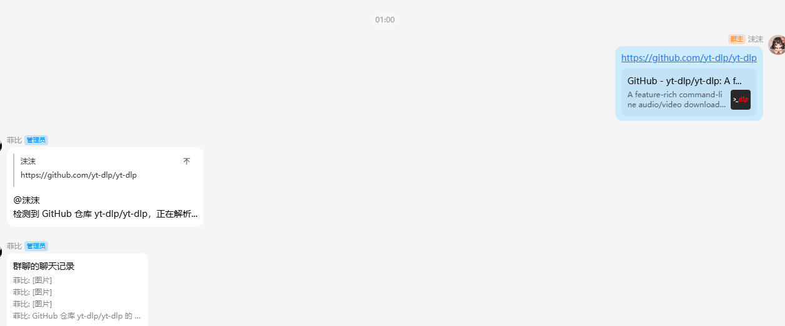
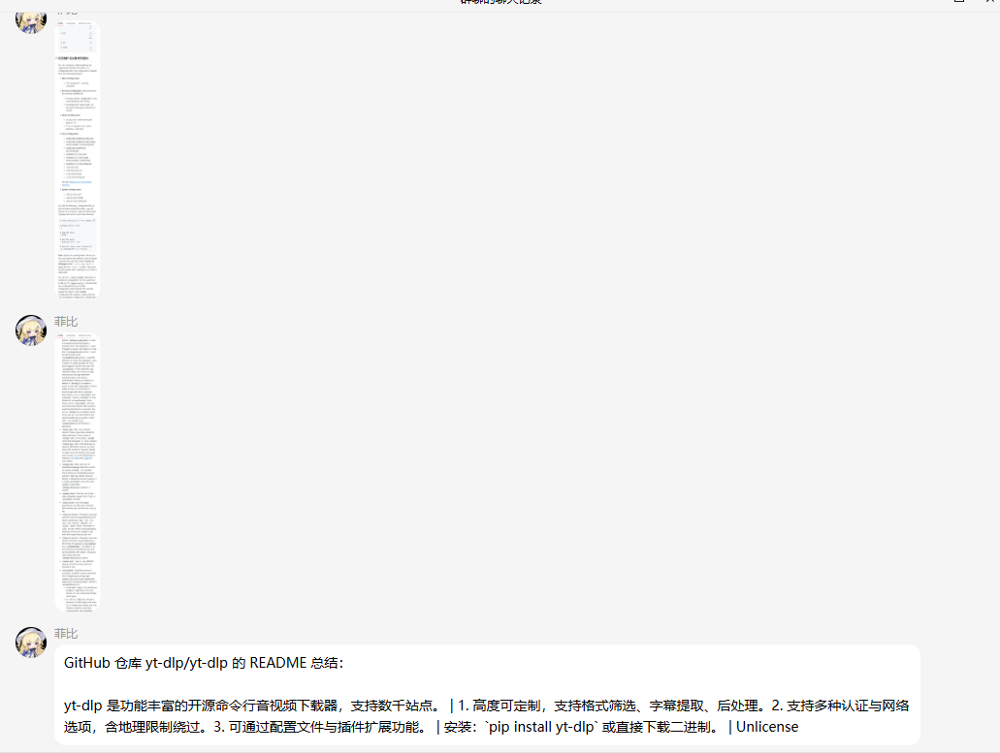

# astrbot_plugin_github_summary

群内 GitHub 链接自动解析插件。当群聊中出现 GitHub 仓库链接时，自动抓取 README 并截图，AI 智能总结，合并转发一条消息发出。

## 这是什么

在群聊里发 GitHub 仓库链接（比如 `https://github.com/yt-dlp/yt-dlp`），机器人会自动：

1. 检测链接，解析仓库信息
2. 用手机模式打开页面，截图 README（超长页面自动分 3 段）
3. AI 生成中文总结（项目简介、核心功能、安装方式）
4. 合并转发一条消息发到群里



**AI 总结效果：**



## 怎么安装

### 方式一：插件市场安装

在 AstrBot 插件市场搜索 `astrbot_plugin_github_summary` 并安装。

### 方式二：手动下载

1. 从本仓库下载插件压缩包或 `git clone`
2. 将插件文件夹放入 AstrBot 的 `data/plugins/` 目录
3. 安装依赖：
   ```bash
   pip install -r requirements.txt
   playwright install chromium
   ```
4. 重启 AstrBot，在 WebUI 插件管理页启用即可

### 公共步骤

（可选）在插件配置中填入 GitHub Token，提高 API 频率限制。

## 依赖

| 依赖 | 说明 |
|------|------|
| `playwright >= 1.40.0` | 网页截图引擎 |
| Chromium 浏览器 | 由 `playwright install chromium` 安装 |
| `aiohttp >= 3.9.0` | 异步 HTTP 请求 |
| AstrBot 框架 | 插件运行平台 |

## 怎么使用

安装后无需任何命令，直接使用：

- 在群聊中发送任意 GitHub 仓库链接
- 机器人自动处理，几秒后返回合并转发消息
- 消息包含截图（分 3 段）+ AI 中文总结

**示例：**
发送 `https://github.com/yt-dlp/yt-dlp` → 自动返回截图 + 总结

## 配置

| 配置项 | 说明 | 默认值 |
|--------|------|--------|
| `github_token` | GitHub Personal Access Token（可选，提高频率限制） | 空 |

## 作者

橙猫猫
